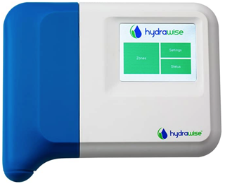

# ioBroker.hydrawise

**Tests:**: 

## Hydrawise adapter for ioBroker

This adapter controls a Hydrawise HC6 from Hunter via the REST API Version 1.4.
Commands are executed and the status of execution is reported via a PROWL interface by push messages which can e.g. being received by a smart phone. Activities of the adapter are also displayed in the info.log of the adapter.

### Adapter Configuration Page

In order to connect to the hydrawise adapter its unique API key has to be configured (\<API Key Hydrawise Adapter\>).
The API key can be generated via the webpage of your hydrawise account in the section "My Account / API key".

In order to sent push messages to e.g. a smart phone via PROWL your unique PROWL API key has to be configured (\<API Key Prowl Account\>).
You can also leave out the PROWL configuration without impacting the hydrawise command execution if you don't have an PROWL account.

### Implemented Commands

Commands are issued by setting the state variable \<command\> in the hydrawise adapter object section.
Always set the necessary parameters for the commands first, before you are writing the \<command\> state variable.

The following commands are implemented:

#### run

This command will run zone \<zone\> for \<custom_run\> seconds.

#### runall

This command will run all zones for \<custom_run\> seconds.

#### stop

This command will stop zone \<zone\> immediately.

#### stopall

This command will stop all zones immediately.

#### suspend

This command will suspend zone \<zone\> until \<custom_suspend\>. 
<custom_suspend> is given in the UNIX time epoche format. For conversion see: (https://www.unixtime.de)

#### suspendall

This command will suspend all zones until \<custom_suspend\>. 
\<custom_suspend\> is given in the UNIX time epoche format. For conversion see: (https://www.unixtime.de)

#### readstatus

This command will read in the hydrawise controller configurations. This is done automatically once the adapter starts.
The configuration must be re-read whenever the hydrawise controller congiration has changed since the adapter start.

#### Changelog

### 0.0.1
* (Andreili1000) initial release

## License
MIT License

Copyright (c) 2020 Author <60061677+Andreili1000@users.noreply.github.com>

Permission is hereby granted, free of charge, to any person obtaining a copy
of this software and associated documentation files (the "Software"), to deal
in the Software without restriction, including without limitation the rights
to use, copy, modify, merge, publish, distribute, sublicense, and/or sell
copies of the Software, and to permit persons to whom the Software is
furnished to do so, subject to the following conditions:

The above copyright notice and this permission notice shall be included in all
copies or substantial portions of the Software.

THE SOFTWARE IS PROVIDED "AS IS", WITHOUT WARRANTY OF ANY KIND, EXPRESS OR
IMPLIED, INCLUDING BUT NOT LIMITED TO THE WARRANTIES OF MERCHANTABILITY,
FITNESS FOR A PARTICULAR PURPOSE AND NONINFRINGEMENT. IN NO EVENT SHALL THE
AUTHORS OR COPYRIGHT HOLDERS BE LIABLE FOR ANY CLAIM, DAMAGES OR OTHER
LIABILITY, WHETHER IN AN ACTION OF CONTRACT, TORT OR OTHERWISE, ARISING FROM,
OUT OF OR IN CONNECTION WITH THE SOFTWARE OR THE USE OR OTHER DEALINGS IN THE
SOFTWARE.

## Legal

This project is not affiliated directly or indirectly with the company Hunter.

Hydrawise is a registered trademark of Hunter.
